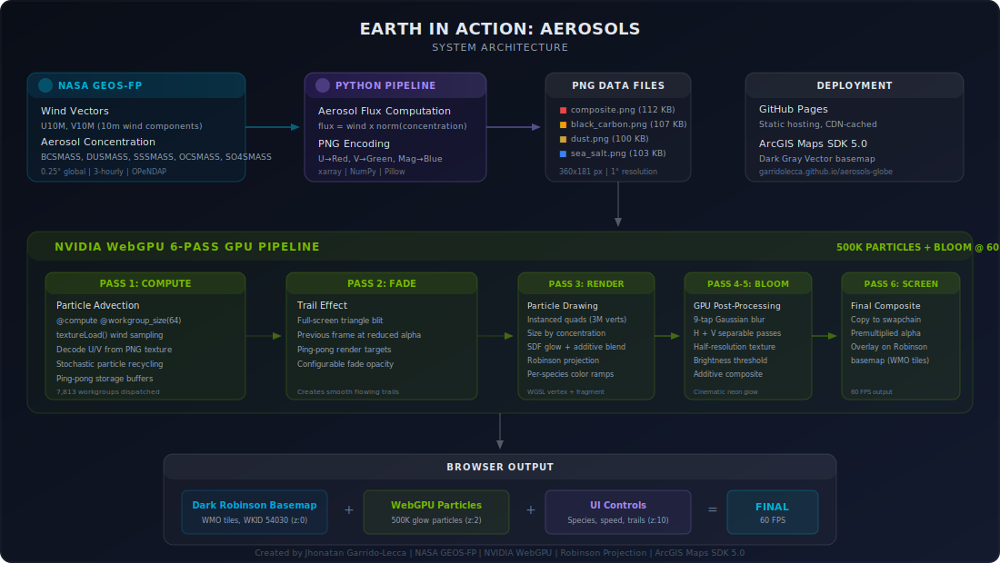

# Earth in Action — Aerosols

GPU-accelerated visualization of real atmospheric aerosol transport using NASA GEOS-FP satellite data, NVIDIA WebGPU compute shaders, and Robinson projection.

**[View Live Demo](https://garridolecca.github.io/aerosols-globe/)**

## System Architecture



## Features

- **500,000 GPU-accelerated particles** via WebGPU compute shaders (falls back to Canvas 2D with 8K particles)
- **Real NASA aerosol data** — wind vectors weighted by aerosol concentration from GEOS-FP
- **Four aerosol species** — Total Composite, Black Carbon, Mineral Dust, Sea Salt
- **6-pass GPU pipeline** — Compute → Fade → Render → Bloom H → Bloom V → Screen
- **Concentration-based particle sizing** — thick trails over hotspots, thin wisps in clean air
- **GPU bloom post-processing** — cinematic neon glow around high-concentration areas
- **Robinson projection** — full-world view using WMO Robinson Agreed vector tiles
- **Dark basemap** — custom-styled WMO tiles (near-black ocean, dark blue-black land, subtle coastlines)
- **Interactive controls** — particle count (up to 1M), speed, trail length, particle size
- **Auto-fallback** — WebGPU → Canvas 2D for browser compatibility

## Data Pipeline

```
NASA GEOS-FP (OPeNDAP) → Python (weight wind × aerosol) → PNG encoding → WebGPU texture → Compute shader → Bloom → Screen
```

1. **Data Acquisition** — Wind (U10M, V10M) + aerosol mass (BCSMASS, DUSMASS, SSSMASS, OCSMASS, SO4SMASS) from NASA GEOS-FP at 0.25° global resolution via OPeNDAP (no auth required)
2. **Flux Computation** — `flux = wind × normalized(aerosol_concentration)` — preserves wind direction, scales magnitude by concentration
3. **PNG Encoding** — U→Red, V→Green, Magnitude→Blue (~100KB per species at 1° resolution)
4. **GPU Rendering** — WebGPU compute shader advects 500K particles in parallel, sized by concentration, rendered with SDF circular glow and additive blending, with Gaussian bloom post-processing

## GPU Pipeline (6 passes per frame)

| Pass | Name | Description |
|------|------|-------------|
| 1 | **Compute** | WGSL compute shader advects 500K particles via `textureLoad()` wind sampling, stochastic recycling |
| 2 | **Fade** | Full-screen blit with reduced alpha for trail effect (ping-pong render targets) |
| 3 | **Render** | Instanced quads (3M vertices) with SDF glow, concentration-based sizing, additive blending |
| 4 | **Bloom H** | Horizontal 9-tap Gaussian blur at half resolution on bright pixels |
| 5 | **Bloom V** | Vertical blur composited additively back onto trail texture |
| 6 | **Screen** | Copy final composited result to swapchain canvas with premultiplied alpha |

## Tech Stack

| Component | Technology |
|-----------|-----------|
| GPU Compute | WebGPU API + WGSL compute shaders |
| Particle Rendering | Instanced quads, SDF glow, additive blending, GPU bloom |
| Projection | Robinson (WKID 54030) via WMO Robinson Agreed VectorTileServer |
| Basemap | Custom dark-styled WMO Robinson vector tiles (ArcGIS Maps SDK 5.0) |
| Data Source | NASA GMAO GEOS-FP 0.25° via OPeNDAP |
| Processing | Python (xarray, NumPy, Pillow) |
| Hosting | GitHub Pages |

## Refreshing Data

```bash
python process_aerosols.py    # Download latest GEOS-FP wind + aerosol data
python encode_wind_png.py     # Encode as PNG for GPU texture
git add data/ && git commit -m "Update aerosol data" && git push
```

## Credits

Created by **Jhonatan Garrido-Lecca**

Powered by NASA GEOS-FP, NVIDIA WebGPU, ArcGIS Maps SDK, and WMO Robinson projection.
